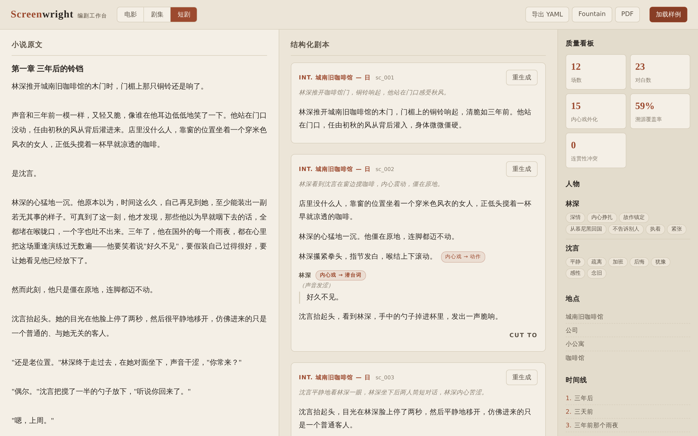
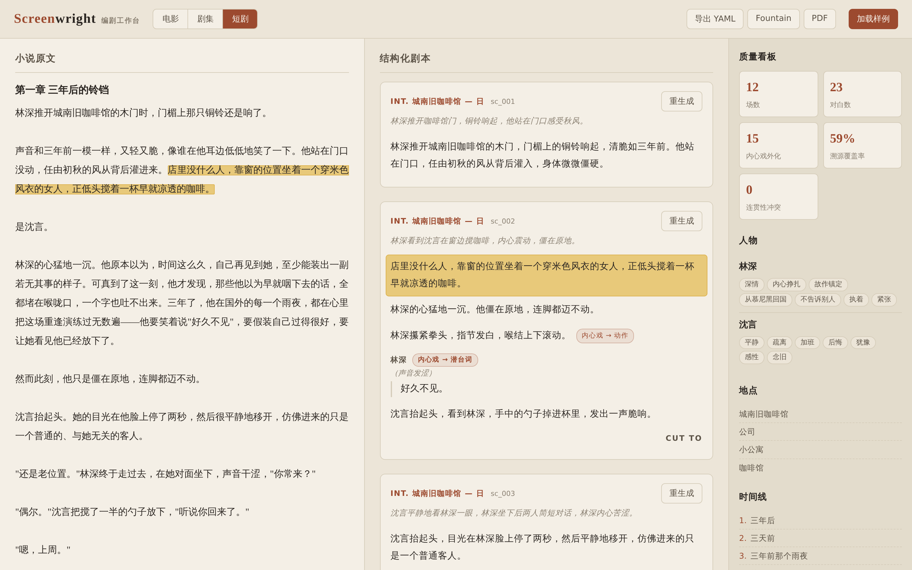
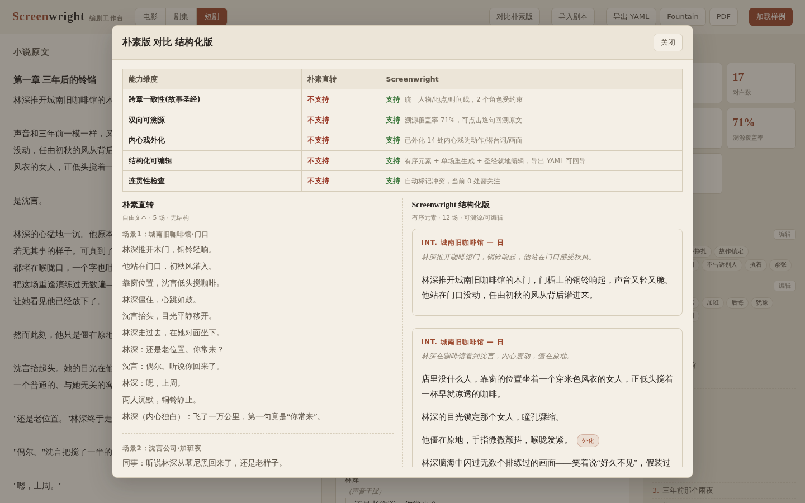
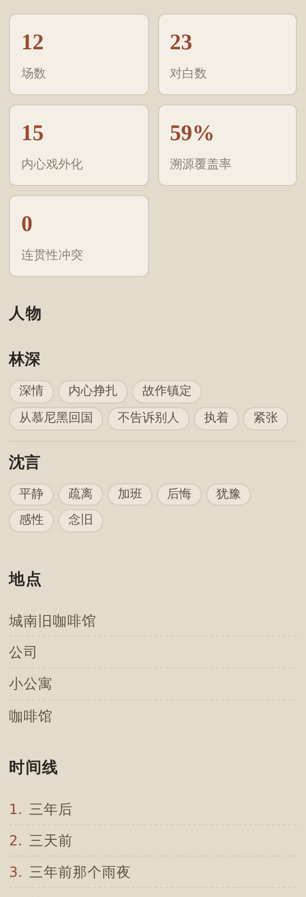

# Screenwright · 小说转剧本智能编剧工作台

> 七牛云 × XEngineer 暑期实训营 第三批次 · 题目三作品
>
> 把 3 章以上的小说，自动转换为**结构化、可编辑、可溯源、可按目标媒介重渲染**的剧本（YAML / Fountain / PDF）。

[演示视频](https://script.qiniu.zdwktlj.top/demo/screenwright-demo.mp4) · [在线试用 https://script.qiniu.zdwktlj.top](https://script.qiniu.zdwktlj.top) · [Schema 设计文档](docs/schema-design.md)

---

## 一句话定位

Screenwright 不是"切块丢给大模型"的转换器，而是一个**编剧工作台**：它把一部小说理解为故事世界（人物 / 地点 / 时间线），再逐场生成结构化剧本，每一行都能点回原文、可按媒介重渲染、并自动检查跨章连贯性。

## 四大创新点

1. **可控媒介改编（film / series / short_drama）**：`meta.target_medium` 一处声明、全局生效。同一套故事圣经与场景切分，可按电影、剧集、**短剧**三种媒介重渲染出不同节奏的剧本——短剧版强调强冲突与金句，契合中国短剧市场。
2. **行级双向溯源**：每个动作行、每句对白都带 `source_ref`（章号 + 原文字符区间 `spans`）。前端点剧本即可在原文精确高亮，双向可查，作者可审计、可打磨。字符偏移而非行号，不受排版换行影响。
3. **内心戏外化**：自动识别小说里不可拍的内心独白 / 旁白描写，外化为动作 / 潜台词 / 画外音 / 视觉化，并用 `adaptation` 标记显式记录"从什么外化成什么"。**透明可审计、可一键筛出回退**，既是创新也是对"改编可信度"的工程化交代。
4. **连贯性检查**：跨场时间线（`Heading.time_ref` 关联 `TimePoint.order`）与人物认知冲突，以 `ContinuityFlag`（info / warn / error 三级）标注落到具体场景，前端分级标黄标红。

## 亮点演示

- 演示视频：<https://script.qiniu.zdwktlj.top/demo/screenwright-demo.mp4>（覆盖核心流程：双向溯源、媒介改编、单场重生成、导出；B 站镜像链接稍后补充）。
- 在线试用：<https://script.qiniu.zdwktlj.top>（内置中文网文与英文《傲慢与偏见》两份样本，一键试用）。

## 界面截图

| 编剧工作台（原文 / 结构化剧本 / 质量看板 三栏） | 行级双向溯源（点剧本，原文同步高亮） |
|---|---|
|  |  |

| 朴素切块 vs 本工具（五维差异并排对比） | 故事圣经与质量看板 |
|---|---|
|  |  |

---

## 架构

```
┌──────────────────────────────────────────────────────────────┐
│  前端工作台  React + Vite + TypeScript                          │
│  分屏：原文窗(NovelPane) ←双向溯源高亮→ 剧本窗(ScriptPane)        │
│  媒介切换 · 单场重生成 · 质量看板 · 一键导出                       │
└───────────────────────────┬──────────────────────────────────┘
                            │ HTTP / SSE
┌───────────────────────────▼──────────────────────────────────┐
│  编排后端  FastAPI（仅编排+传输+安全，不重写业务逻辑）             │
│  CORS 白名单 · 按 IP 滑动窗口限流 · 原文不落盘不写日志            │
└───────────────────────────┬──────────────────────────────────┘
                            │ 线程池跑同步管线，每个 Pass 推 SSE 进度
┌───────────────────────────▼──────────────────────────────────┐
│  离线多轮管线（pipeline）                                        │
│                                                               │
│  Pass0 ingest    小说 → 分章 + 分块（滚动摘要扛长上下文）          │
│  Pass1 bible     抽人物/地点/时间线（StoryBible，单一事实源）      │
│  Pass2 segment   场景切分（时空连续）+ 场级 source_ref            │
│  Pass3 generate  逐场生成（注入本场原文+bible切片+上场尾+媒介）     │
│                  内含内心戏外化 → adaptation 标记                 │
│  Pass4 continuity 连贯性检查回填 continuity_flags                │
│  Pass5 metrics   量化质量看板（纯统计，秒出）                     │
│       + export   导出 YAML（主）/ Fountain / PDF                 │
└───────────────────────────┬──────────────────────────────────┘
                            │
                    YAML / Fountain / PDF
```

各 Pass 职责：

| Pass | 模块 | 输入 → 输出 | 说明 |
|------|------|-------------|------|
| Pass0 ingest | `pipeline/ingest.py` | 原文 → `Novel`（章/块） | 分章、分块，滚动摘要应对长上下文。 |
| Pass1 bible | `pipeline/bible.py` | `Novel` → `StoryBible` | 抽取人物/地点/时间线，作为跨章一致性的**单一事实源**。 |
| Pass2 segment | `pipeline/segment.py` | `Novel`+`StoryBible` → `list[SceneStub]` | 按时空连续切分场景，每个 stub 带场级 `source_ref`。 |
| Pass3 generate | `pipeline/generate.py` | stub+原文+bible切片+上场尾+媒介 → `list[Scene]` | 逐场生成剧本元素序列，识别内心戏并外化、打 `adaptation` 标记。 |
| Pass4 continuity | `pipeline/continuity.py` | `Screenplay` → `Screenplay` | 跨场时间线 / 认知冲突检查，回填 `continuity_flags`。 |
| Pass5 metrics + export | `pipeline/metrics.py` `pipeline/export.py` | `Screenplay` → 指标 dict / 三种产物 | 量化看板（纯统计、不联网）；导出 YAML / Fountain / PDF。 |

数据契约（顶层 `Screenplay = meta + story_bible + scenes`，`elements` 为有序带类型判别联合）见 [docs/schema-design.md](docs/schema-design.md)，权威实现为 `backend/app/schema/models.py`。

## 技术栈

- **后端**：Python 3.10 + FastAPI + pydantic v2（schema 即契约 + 校验 + 非法 YAML 自动修复）+ SSE 进度流；openai SDK 走 OpenAI 兼容端点调用 LLM（默认 DeepSeek，支持多端点切换）。
- **前端**：React 18 + Vite 5 + TypeScript（分屏工作台、双向溯源高亮、媒介切换、质量看板）。
- **部署**：docker-compose（backend 容器 + Caddy 反代静态前端，自动 HTTPS）→ VM，子域名 `script.qiniu.zdwktlj.top`。

---

## 快速开始

### 方式一：Docker（推荐）

LLM 密钥不入仓库，需自行在 `.secrets/runtime.env` 提供（compose 通过 `env_file` 注入 backend 容器）。变量名清单（**只列名，不含值**）：

```
# LLM 提供方（默认 deepseek，可用 LLM_PROVIDER 切换 deepseek/azure/zhipu/f3000）
LLM_PROVIDER
DEEPSEEK_API_KEY
DEEPSEEK_BASE_URL
DEEPSEEK_CHAT_MODEL
DEEPSEEK_REASONER_MODEL

# 可选：公网安全（部署时收紧）
ALLOWED_ORIGINS          # CORS 白名单，逗号分隔，缺省 "*"
CONVERT_RATE_LIMIT       # 每 IP 每窗口最大 convert 次数，缺省 10
CONVERT_RATE_WINDOW      # 限流窗口秒数，缺省 60
```

> 备用端点（按需提供其一并设 `LLM_PROVIDER`）：`AZURE_OPENAI_*`、`ZHIPU_GLM_FREE_*`/`ZHIPU_BASE`、`F3000_*`。

前端构建产物（`frontend/dist`）由 Caddy 静态托管。启动：

```bash
# 先构建前端静态资源（Caddy 挂载 frontend/dist）
cd frontend && npm install && npm run build && cd ..

# 启动后端 + Caddy
docker compose up --build
```

### 方式二：本地开发

后端（需先 `source` 含 `DEEPSEEK_API_KEY` 等的环境）：

```bash
pip install -r backend/requirements.txt
# 业务模块包名是 app.*，需让 backend 在 PYTHONPATH 上
PYTHONPATH=backend uvicorn app.api.main:app --reload --port 8000
```

前端：

```bash
cd frontend
npm install
npm run dev
```

端到端冒烟（真实 LLM 串起全管线，先 `source` 密钥）：

```bash
python scripts/e2e_smoke.py
```

---

## API 端点

| 方法 | 路径 | 说明 |
|------|------|------|
| GET | `/api/health` | 存活探针，返回 `{"status":"ok"}`，给反代 / 监控用。 |
| GET | `/api/sample` | 返回内置样本列表 `[{id,title,text}]`（一键试用，中文网文 + 英文 P&P）。 |
| POST | `/api/convert` | 小说 → 剧本，**SSE 流式**返回每个 Pass 的进度事件，末事件含完整 `screenplay`、`metrics`、各章原文（供前端溯源高亮）。按 IP 限流。 |
| POST | `/api/regenerate_scene` | **编辑安全**的单场重生成：只接受并返回单场，绝不触碰其他场；支持传入编辑指令与目标媒介。 |
| POST | `/api/export` | 导出剧本为 `yaml` / `fountain` / `pdf`（先校验整份 `screenplay` 合法再导出）。 |

---

## 依赖与原创说明

### 第三方库

后端（`backend/requirements.txt`）：

| 库 | 用途 |
|----|------|
| `fastapi` | Web 框架，提供 HTTP 端点。 |
| `uvicorn[standard]` | ASGI 服务器，运行 FastAPI。 |
| `pydantic` (v2) | 数据契约定义 + 校验 + 判别联合 + 序列化往返。 |
| `pyyaml` | YAML 序列化 / 反序列化（剧本主格式）。 |
| `openai` | OpenAI 兼容客户端，调用 LLM（DeepSeek 等）。 |
| `httpx` | openai SDK 的底层 HTTP 依赖。 |
| `tenacity` | LLM 调用的指数退避重试。 |
| `sse-starlette` | `/api/convert` 的 SSE 进度流响应。 |
| `python-multipart` | FastAPI 表单 / 文件解析支持。 |
| `fpdf2` | PDF 导出（支持中文字体）。 |
| `pytest` / `pytest-asyncio` | 单元测试与异步测试。 |

前端（`frontend/package.json`）：`react` / `react-dom`（UI）、`vite` / `@vitejs/plugin-react`（构建）、`typescript` 及 `@types/*`（类型）。

部署：`caddy`（反向代理 + 自动 HTTPS + 静态托管）。

### 原创声明

**全部业务逻辑均为原创**，仅调用上述通用第三方库与 LLM API：

- YAML Schema 数据契约（`backend/app/schema/`）：有序带类型判别联合的 `elements`、行级 `source_ref`、`adaptation` 外化标记、单一事实源 `story_bible`、`target_medium` 媒介位、`continuity_flags` —— 设计与实现均原创。
- 离线多轮管线 Pass0–5（`backend/app/pipeline/`）：分章分块与滚动摘要、故事圣经抽取、场景切分、逐场生成与内心戏外化、连贯性检查、量化看板、三格式导出 —— 全部原创。
- 多端点 LLM 客户端（`backend/app/llm/`）：统一 `complete()` 接口、磁盘缓存、重试、用量统计 —— 原创封装（底层仅调 openai SDK）。
- 编排后端的安全与并发设计（CORS 白名单、按 IP 滑动窗口限流、同步管线丢线程池 + SSE 进度、原文不落盘）—— 原创。
- 前端分屏工作台（双向溯源高亮、媒介切换、单场重生成、质量看板）—— 原创。

**演示素材版权**（详见 `backend/samples/README.md`）：

- 英文样本《傲慢与偏见》第 1–3 章，简·奥斯汀（1813），**公有领域**，逐字取自 Project Gutenberg 电子书 #1342。用作"未经我方改写的真实知名文学作品"以证明工具非过拟合。
- 中文网文样本《旧城咖啡》为**原创作品**（作者 tljcpa），专为本项目撰写并授权作为测试输入，零版权风险。
- 本工具不对输入小说主张任何权利；生成剧本的知识产权归原作者所有。

---

## 量化效果

以中文原创样本《旧城咖啡》（3 章）跑通端到端管线（`scripts/e2e_smoke.py`，真实 DeepSeek）的实测数据：

| 指标 | 数值 | 对应创新点 |
|------|------|-----------|
| 场景数 | 12 场 | 完整度 |
| 行级溯源覆盖率 | **70.7%** | ② 双向溯源（内容行可点回原文比例） |
| 内心戏外化元素 | **15** 行 | ③ 内心戏外化（已打 `adaptation` 标记，可回退） |
| 原文覆盖率 | **86.3%** | ② 溯源另一面（剧本场级溯源覆盖的原著字符比例） |
| 英文样例行级溯源 | **66.3%** | ② 跨语言泛化（《傲慢与偏见》3 章，三级模糊定位，证明非中文过拟合） |
| Schema 自检 | 往返**合法** | 工程规范（产物严格遵守自定义契约） |
| 全流程耗时 | 约 **64s** | 离线、可现场试用 |

> 跨语言行级溯源：中文 70–86%、英文 66.3%（三级定位：精确 → 归一 → difflib 模糊），证明管线对中英文均成立。

指标实现见 `backend/app/pipeline/metrics.py`（纯统计、不联网、可在测试里确定性断言）。

此外工作台还提供：**朴素切块 vs 本工具的并排对比**（可视化差异）、**剧本 YAML 导出后手改再导入续编**（导入走 `validate_and_repair` 自动修复用户改坏的 YAML）、**故事圣经就地编辑**、**单场重生成的前后版本对照**。

---

## 文档与许可证

- Schema 设计文档：[docs/schema-design.md](docs/schema-design.md)（顶层结构、逐字段说明、七条核心设计决策与理由、校验修复机制、可扩展性）。
- 许可证：[MIT](LICENSE)。
